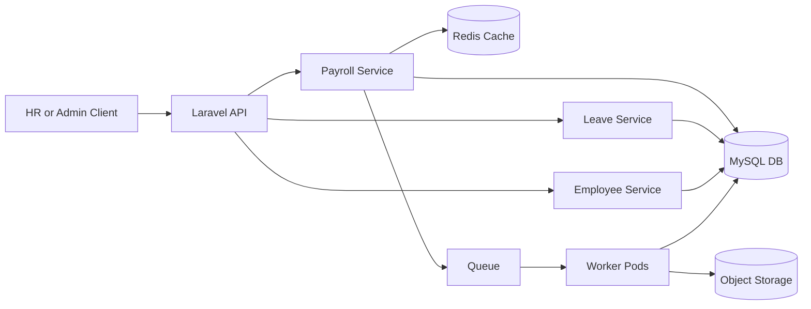

# A. Architecture Design

## High-Level System Architecture



## Architecture Overview

- HR triggers payroll through the API.
- The API validates and coordinates processing.
- Heavy computations run in background workers.
- Results are stored in the database.
- Reports and payslips are generated separately.
- Redis is used for queueing and caching.

---

## Payroll Processing Flow

1. HR starts a payroll run for a specific period.
2. The system checks that payroll for that period has not already been processed.
3. Employees included in the payroll group are identified.
4. Employees are processed in batches in the background.
5. Each employee’s pay is calculated:
   - salary
   - allowances
   - deductions
   - taxes
   - net pay
6. Payroll results are saved securely.
7. Summary totals are generated.
8. Payslips and reports are created.
9. Payroll run is marked as completed.

---

## Service Responsibilities

### Employee Service
- Stores employee profiles
- Compensation settings
- Employment status

### Leave Service
- Leave filing and validation
- Overlap detection
- Holiday-aware deduction

### Payroll Service
- Controls payroll run lifecycle
- Computes salary formulas
- Handles tax and contributions

### Holiday Service
- Central source of truth for public holidays

### Reporting Service
- Generates payslips
- Exports payroll reports
- Provides audit data

---

## Why Use Queues?

Payroll computation is heavy.

Instead of computing thousands of employees inside one API request:

- The system sends payroll jobs to a queue.
- Multiple worker processes handle them in parallel.
- This improves speed and prevents API timeouts.

### Benefits

- Faster processing
- Safe retries if something fails
- Scales easily during payroll periods

---

## Caching Strategy

Redis is used to temporarily store:

- Payroll summary by company + period
- Employee payroll snapshot
- Holiday calendar per year

Cache is refreshed when:

- Payroll is completed
- Leave is approved
- Holiday list changes

---

## Scaling Strategy (8,000 → 50,000 Employees)

### Data Layer

- Proper indexing on payroll tables
- Optional read replicas for reports
- Partition large payroll tables by month

### Processing Layer

- Employees processed in chunks (e.g., 500 per job)
- Worker pods can scale up during payroll week

### API Layer

- Stateless pods behind load balancer
- Rate limiting for expensive endpoints

### Reliability

- Prevent duplicate payroll runs
- Use idempotency keys
- Monitor queue failures

---

# B. Payroll Computation Breakdown

## Net Pay Computation Steps

1. Calculate base salary (prorated if needed).
2. Add overtime and bonuses.
3. Subtract pre-tax deductions (late, absences, unpaid leave).
4. Compute taxable income.
5. Deduct taxes and statutory contributions.
6. Apply post-tax deductions (loans, penalties).
7. Final Net Pay:

```
Net Pay = Gross + Additions - PreTaxDeductions - Tax - Contributions - PostTaxDeductions + Reimbursements
```

---

## Formula Summary

**Gross Pay**

```
Gross = Basic + Allowances + Overtime + Bonus
```

**Taxable Income**

```
Taxable = Gross - PreTaxDeductions
```

**Net Pay**

```
Net = Taxable - Tax - Contributions - PostTaxDeductions + Reimbursements
```

---

## Rounding Strategy

- Use DECIMAL(12,2) in database.
- Avoid floating point numbers.
- Round each component to 2 decimal places (half-up).
- Keep raw values if audit traceability is required.

---

## Edge Cases Considered

- New hire or resignation mid-period
- Leave without pay
- Retroactive salary adjustments
- Negative net pay
- Duplicate imported allowances
- Missing time logs

---

# C. Concurrency & Locking Strategy

## Preventing Duplicate Payroll Runs

Each payroll run is uniquely identified by:

```
(tenant_id, payroll_period, payroll_group)
```

Before starting payroll:

- System checks if a run already exists.
- If yes → reject request.
- If no → mark run as PROCESSING.

---

## Locking Strategy

### Pessimistic Locking
- Locks row during transaction.
- Used when starting or closing payroll runs.

### Optimistic Locking
- Uses version/timestamp checks.
- Better performance for non-critical updates.

Recommended:

- Pessimistic for payroll run creation/finalization.
- Optimistic for metadata updates.

---

# D. Production Case Study

## Real Issue

Duplicate payroll records were created for the same employee and period.

## Root Cause

- Payroll endpoint triggered twice.
- No database unique constraint.
- Worker jobs were not idempotent.

## Solution

- Added unique DB index (employee_id, payroll_run_id).
- Added distributed lock before payroll dispatch.
- Implemented safe upsert logic.
- Enforced payroll state transitions.

## Monitoring Improvements

Added alerts for:

- Duplicate key violations
- Long-running payroll
- Queue backlog spikes
- Failed job rate

---

# Practical Coding Exercise

## Repository

Add link here:

```
<YOUR_REPO_LINK>
```

---

# Leave Filing API Implementation

## Implemented Features

### Endpoints
- POST /api/leave-requests
- GET /api/leave-requests
- Employee and Holiday management endpoints

### Core Rules
- Reject overlapping leave requests
- Deduct holidays from leave days
- Store deductible_days

### Database Tables
- employees
- holidays
- leave_requests

### Test Coverage
- Valid leave request
- Overlapping leave
- Holiday edge case
- List/filter behavior

---

## Architecture & Code Quality

- Form Request validation
- Service layer for business rules
- Clean controllers
- Resource-based API responses
- PHPUnit feature tests

---

## Run Tests

```
php artisan test --filter LeaveFilingTest
```
