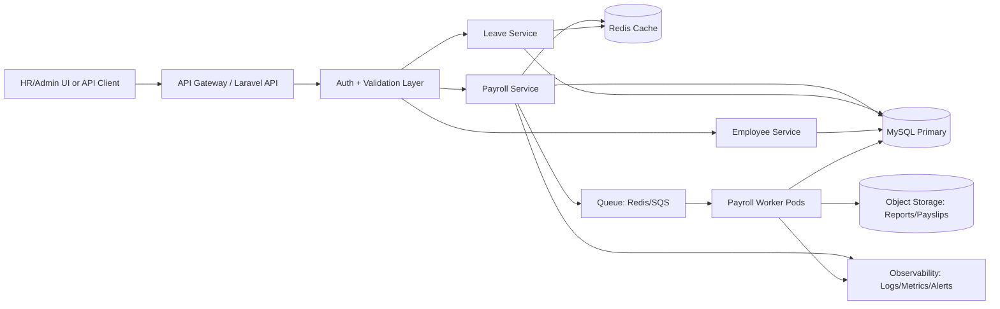

# Lastname_Firstname_SeniorFullstackExam

## A. Architecture Design

### High-Level System Architecture Diagram



### Payroll Processing Flow
1. Payroll run is requested (manual trigger or scheduled job).
2. API validates period, payroll group, and run type.
3. System acquires payroll-run lock (idempotency + concurrency control).
4. Employees in scope are chunked and dispatched to queue jobs.
5. Worker computes gross pay, deductions, tax, adjustments, and net pay.
6. Result rows are stored transactionally in payroll tables.
7. Summary is cached and exposed via API.
8. Payslips/reports are generated asynchronously and stored.
9. Run is marked `COMPLETED` (or `FAILED` with retry metadata).

### Service Boundaries
- Employee Service: master data (employee profile, status, compensation settings).
- Leave Service: leave requests, overlaps, holiday-aware deductions, balances.
- Payroll Service: payroll period orchestration, formulas, taxes, contributions, net pay.
- Holiday/Calendar Service: public holiday source of truth used by leave/payroll.
- Reporting Service: payslips, exports, audit views.

### Queue Usage
- Use queue for heavy and parallelizable tasks:
  - per-employee payroll computation
  - report generation and export
  - notification sending
- Benefits:
  - lower API response latency
  - controlled retries and dead-letter handling
  - horizontal worker scaling during payroll windows

### Caching Strategy
- Redis cache keys:
  - payroll run summary by `company_id + period`
  - employee payroll snapshot by `employee_id + period`
  - holiday calendar by year and tenant
- Invalidation:
  - event-driven (`PayrollComputed`, `LeaveApproved`, `HolidayUpdated`)
  - TTL for non-critical aggregates
- Guardrails:
  - cache-aside pattern
  - include version/timestamp in cache value for safe refresh

### Scaling Strategy (8k -> 50k Employees)
- Data:
  - proper indexes on `(company_id, period)`, `(employee_id, period)`, status columns
  - read replicas for reporting queries
  - partition large payroll result tables by period/month
- Compute:
  - chunk employees (e.g., 500–1,000/job)
  - autoscale queue workers by backlog depth and processing SLA
- API:
  - stateless app pods behind load balancer
  - rate limits for expensive endpoints
- Reliability:
  - idempotency keys for payroll trigger endpoints
  - dead-letter queues and replay tooling
- Observability:
  - SLO on payroll completion time
  - queue lag and failed job alerts

## B. Payroll Computation Breakdown

### Step-by-Step Net Pay Computation
1. Determine base gross amount:
   - prorated basic salary (if partial period)
   - allowances (fixed + variable)
2. Compute additions:
   - overtime
   - bonuses/incentives
3. Compute pre-tax deductions:
   - absences/late deductions
   - leave without pay
4. Compute taxable income.
5. Calculate statutory deductions:
   - tax withholding
   - social/security/health contributions
6. Apply post-tax adjustments:
   - loans, penalties, reimbursements
7. Final net pay:
   - `Net Pay = Gross + Additions - PreTaxDeductions - Statutory - PostTaxDeductions + Reimbursements`

### Formula Explanation
- Gross Pay:
  - `Gross = Basic + Allowances + Overtime + Bonus`
- Taxable Income:
  - `Taxable = Gross - PreTaxDeductions`
- Net Pay:
  - `Net = Taxable - Tax - Contributions - PostTaxDeductions + Reimbursements`

### Rounding Strategy
- Use decimal precision (`DECIMAL(12,2)` in DB, not float).
- Round each component to 2 decimals using a consistent rule (half-up).
- Final net pay re-rounded to 2 decimals after aggregation.
- Keep raw unrounded intermediate values for audit traceability when required.

### Edge Cases
- New hire or resigning mid-period (proration).
- Unpaid leave overlaps holidays/weekends.
- Negative net pay (carry-forward or cap policy).
- Retroactive adjustments after payroll finalized.
- Missing time logs/overtime records.
- Duplicate allowances loaded from integration.

## C. Concurrency & Locking Strategy

### Preventing Duplicate Payroll Runs
- Enforce unique run key: `(tenant_id, payroll_period, payroll_group)`.
- Acquire distributed lock before dispatch.
- Mark run as `PROCESSING` in a transaction and reject duplicate triggers.

### Example Laravel-Style Pseudocode

```php
DB::transaction(function () use ($tenantId, $period, $group) {
    $exists = PayrollRun::query()
        ->where('tenant_id', $tenantId)
        ->where('period', $period)
        ->where('group_code', $group)
        ->whereIn('status', ['PROCESSING', 'COMPLETED'])
        ->lockForUpdate()
        ->exists();

    if ($exists) {
        throw ValidationException::withMessages([
            'period' => ['Payroll already processing or completed for this scope.'],
        ]);
    }

    PayrollRun::create([
        'tenant_id' => $tenantId,
        'period' => $period,
        'group_code' => $group,
        'status' => 'PROCESSING',
    ]);
});
```

### Pessimistic vs Optimistic Locking
- Pessimistic locking:
  - locks DB rows during transaction (`FOR UPDATE`)
  - strong protection against concurrent writes
  - good for payroll-run trigger and finalization paths
- Optimistic locking:
  - uses version/timestamp check on update
  - better throughput for mostly non-conflicting updates
  - requires retry logic on conflict
- Recommendation:
  - pessimistic for run creation/final close
  - optimistic for non-critical bulk metadata updates

## D. Production Case Study

### Real Bug
- Issue: duplicate payroll records for same employee and period.

### Root Cause
- Payroll trigger endpoint was called twice within seconds.
- Queue jobs lacked idempotency guard.
- No unique constraint for `(employee_id, payroll_run_id)` in result table.

### Prevention
- Added DB unique index to enforce one result per employee per run.
- Added idempotency key and distributed lock on run trigger.
- Added safe upsert behavior in worker.
- Added run state machine checks (`PENDING -> PROCESSING -> COMPLETED/FAILED`).

### Monitoring Improvements
- Alert on:
  - duplicate key violation spikes
  - run duration threshold breach
  - queue backlog and retry spikes
- Dashboards:
  - run progress %, processed/failed employees, ETA
  - net pay anomaly detection (unexpected large variance)

## Practical Coding Exercise (Mandatory)

### Git Repository Link
- Add your repository URL here: `<YOUR_REPO_LINK>`

### Implemented: Leave Filing API

Requirements delivered:
- REST endpoints:
  - `POST /api/leave-requests`
  - `GET /api/leave-requests`
  - supporting endpoints: `GET/POST /api/employees`, `GET/POST /api/holidays`
- Overlapping date validation:
  - rejects new leave if it intersects existing leave for same employee
- Holiday-aware deduction:
  - `deductible_days` excludes holiday dates inside leave range
- Database migrations:
  - `employees`, `holidays`, `leave_requests`
- PHPUnit test coverage:
  - valid leave
  - overlapping leave
  - holiday edge case
  - list/filter behavior

Architecture and code style delivered:
- Form Request validation:
  - `StoreLeaveRequest`, `ListLeaveRequest`, plus employee/holiday requests
- Service layer:
  - `LeaveFilingService`, `LeaveOverlapChecker`, `HolidayCalendar`
- Clean controller:
  - `LeaveRequestController` delegates business rules to services
- Resource-based API output:
  - `LeaveRequestResource`

### Test Command

```bash
php artisan test --filter LeaveFilingTest
```
